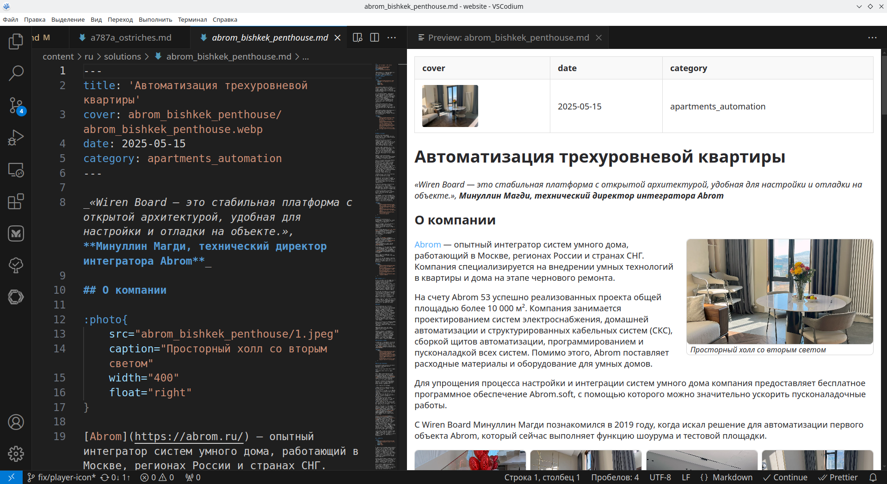
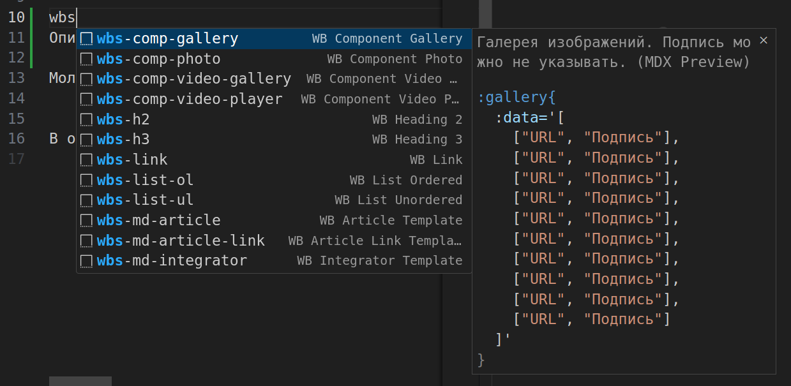
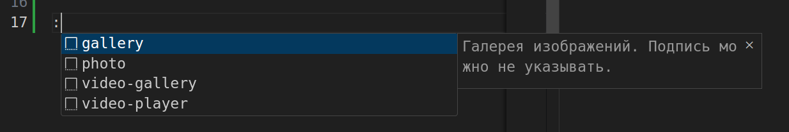
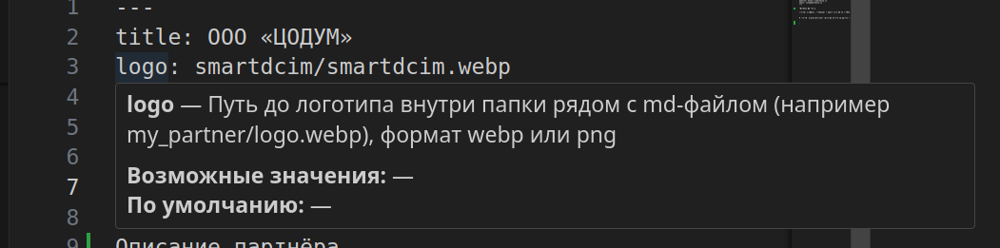
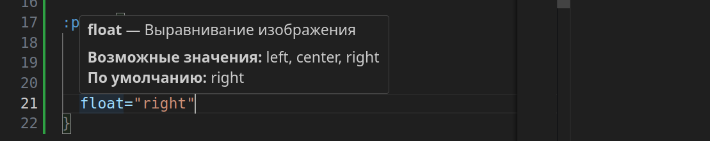

# vscode-mdx-wb-editor-tools

## Установка и использование

Загрузите свежую версию расширения из [Releases](https://github.com/wirenboard/vscode-mdx-wb-editor-tools/releases).

1. Откройте палитру команд (Ctrl+Shift+P)
2. `>Extensions: Install from VSIX...`
3. Укажите путь к файлу .vsix

Открыть предпросмотр:
1. Откройте палитру команд (Ctrl+Shift+P)
2. `>Show MDX WB Preview`

## Описание

Кастомный рендер md-файлов из репозитория https://github.com/wirenboard/website

Основная идея — находить в тексте [компоненты](https://github.com/wirenboard/website/blob/main/doc/components.md) и рендерить их в html, по пути подтягивая файлы картинок.

Кроме этого умеет подсвечивать кастомные компоненты, показывать справку по ним и их аттрибутам, а также работают сниппеты и автодополнение.

Важно понимать, что предпросмотр лишь примерно воспроизводит итоговый результат и призван помочь убедиться что все компоненты оформлены верно и пути к картинкам корректны. Но этого достаточно в подавляющем большинстве случаев, так как внешний вид на сайте в конечном счёте не сильно зависит от того как вы оформили статью.



### Компоненты

Пока умеет только:

- `photo`
- `gallery`
- `video-player`
- `video-gallery`

### Сниппеты

Чтобы было проще создавать страницы или добавлять на них разметку и компоненты, есть сниппеты. Это такие готовые блоки кода, которые можно вставлять в текст документа.

Для использования: введите префикс (например `wbs-comp-photo`) и нажмите `Tab`.



### Автодополнение компонент

Похоже на сниппеты, но вызывается по другому через двоеточие `:` и покрывает только компоненты.

Для использования: введите префикс (например `:photo`) и нажмите `Tab`.



### Справка по компонентам и атрибутам

Есть встроенная справка с описанием компонентов и артибутов. Притом, она работает и с атрибутами фронтматтера страниц. Фронтматтер — это кусок в начале страницы обрамлённый `---`.




## Настройки автообновления

По умолчанию расширение раз в сутки запрашивает из этого репозитория наличие новой версии и, если она есть, предлагает установить.

Поведение можно настроить, например, изменить интервал проверки обновления или отключить проверку совсем.

Настройки автообновления доступны в интерфейсе VS Code:
1. Откройте Файл → Настройки → Параметры
2. Найдите Расширения → "MDX WB Editor Tools"
3. Доступные параметры:
   -  Enable/disable auto-update checks (по умолчанию: true)
   - Check interval in hours (0 = при каждом запуске, по умолчанию: 24 часа)

Также настройки можно указать в конфиге вручную:
```json
    "wirenboard.vscode-mdx-wb-editor-tools.autoUpdate": true,
    "wirenboard.vscode-mdx-wb-editor-tools.updateCheckIntervalHours": 1
```

## Разработчикам расширения
### Добавление кастомных рендеров

#### 1. MDX-компонент

Допустим, есть компонент с данными:

```md
:myComponent{
data='[
{"name":"Item One","value":42},
{"name":"Item Two","value":99}
]'
}
```

#### 2. HTML-шаблон (Handlebars)

Создаем `templates/myComponent.hbs`:

```hbs
<div class="mdx-my-component">
  {{#each items}}
    <article class="my-component-item">
      <h3>{{name}}</h3>
      <p>Value: {{value}}</p>
    </article>
  {{/each}}
  {{#if error}}<div class="error">{{error}}</div>{{/if}}
</div>
```

#### 3. Регистрация шаблона

Добавить в `templateManager.ts`:

```ts
  private readonly templates: {
    // ... existing templates ...
    myComponent: Handlebars.myComponent;
  };

    this.templates = {
      // ... existing templates ...
      myComponent: this.compileTemplate(path.join(templatesDir, 'myComponent.hbs'))
    };
```

#### 4. Реализация рендерера

Добавляем в `renderer.ts`:

```ts
private componentRenderers: Record<string, ComponentRenderer> = {
  // ... existing renderers ...

  myComponent: (attrs, webview, docUri, templates) => {
    try {
      const items = JSON.parse(attrs.data || '[]');
      return templates.myComponent({ items, error: null });
    } catch (error) {
      return templates.myComponent({
        items: [],
        error: 'Invalid JSON format'
      });
    }
  }
};
```

#### 5. Стилизация

```css
.mdx-my-component {
  display: grid;
  gap: 1rem;
  padding: 1rem;
  background: #f8f8f8;
}

.my-component-item {
  border-left: 3px solid #4caf50;
  padding: 0.5rem 1rem;
}

.mdx-my-component .error {
  color: #f44336;
  font-style: italic;
}
```

#### 6. Сниппеты и справка

Описать новый компонент в файле `snippets/components.json`.

#### Пути к картинкам

Если надо отрисовать картинки, то путь к ним надо подготовить:

```ts
  src: this.resolveRelativePath(webview, docUri, src),
```

src — путь к картинке в md-файле.

### Сборка

#### Установка утилиты vsce и зависимостей

Установка сборщика пакетов для vscode:
```
sudo npm install -g vsce
```
Установка зависимостей для проекта:
```
npm install
```

#### Компиляция и упаковка

```
npm run package
```

Собранный плагин будет в папке `dist`.

#### Установка/обновление

```
codium --install-extension ./dist/vscode-mdx-wb-editor-tools-X.Y.Z.vsix --force
vscode --install-extension ./dist/vscode-mdx-wb-editor-tools-X.Y.Z.vsix --force
```
